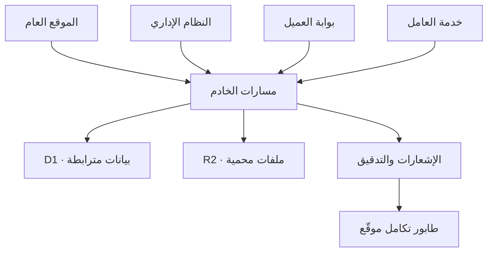
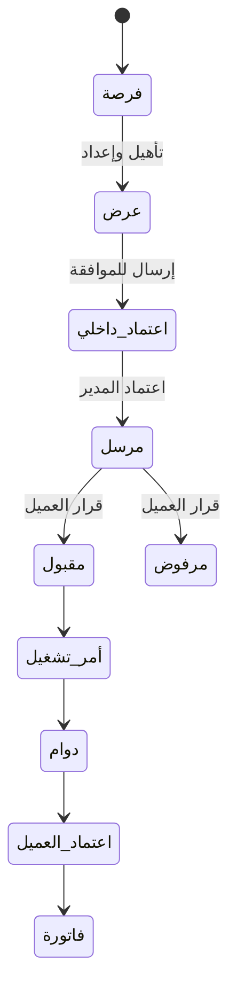

# معمارية منصة دالي

## الحدود الوظيفية

- الموقع العام: صفحات خدمات وقطاعات ومناطق خدمة ومشروعات واعتمادات ومعرفة ووظائف وشركاء وأسئلة شائعة، وصفحة الحج والتواصل والبحث والشكاوى، وطلبات عروض الأسعار، والمحادثة، وطلبات أصحاب البيانات. تُدار الهوية والواجهة وهذه المجموعات من وحدة «إدارة الموقع» لتوليد metadata وJSON-LD وخريطة موقع وبحث داخلي متسقة.
- النظام الإداري: المبيعات، التشغيل، العمالة، الدوام، المالية، القانوني، المستندات، المحادثات، المستخدمون، الإشعارات، والتكامل.
- بوابة العميل: عروض السعر وأوامر التشغيل وكشوف الدوام والمستندات والفواتير الخاصة بالعميل فقط.
- خدمة العامل: الملف والإسناد وسجلات الدوام والمرفقات الخاصة بالعامل فقط.

## قرارات التصميم

1. التحقق من الهوية والصلاحية وملكية السجل يتم في الخادم لكل مسار؛ إخفاء عنصر في الواجهة ليس ضابط وصول.
2. عمليات الإنشاء الحساسة تستخدم مفاتيح عدم التكرار، وانتقالات العروض والفرص وأوامر التشغيل والدوام تستخدم رقم إصدار لمنع فقد التحديث.
3. كل انتقال مهم يُكتب في سجل النشاط وسجل الحالات، ثم يُصدر إشعار وحدث تكامل عند الحاجة.
4. الملفات تحفظ في R2، وتتحقق تواقيعها السحرية قبل التخزين، بينما تحتفظ D1 بالبيانات الوصفية فقط.
5. روابط المشاركة لا تخزن الرمز السري بصورته الأصلية، وتدعم الانتهاء وحد التنزيل والإبطال والتدقيق.
6. النماذج العامة تخضع لتقييد موزع مبني على D1، مع منع الطلبات المتقاطعة والتحقق من المدخلات.
7. البيانات المقروءة من البوابات تُصفّى دائماً بمعرف العميل أو العامل، ولا تعتمد على معرف يرسله المتصفح وحده.
8. محتوى الموقع يحفظ كوثيقة JSON مُنقاة في `portal_settings` بالمفتاح `website-content-v1` مع رقم إصدار وقفل تفاؤلي؛ لا تعرض الواجهة العامة المسودات أو محتوى قسم معطّل، حتى داخل بيانات ترطيب React.
9. النشر من وحدة الموقع يتطلب صلاحية `website:write` في الخادم، ويُسجل في التدقيق ويصدر إشعارًا إداريًا. المدير العام يقرأ ويكتب افتراضيًا، بينما يمكن منح صلاحية صريحة بحسب سياسة الوصول.
10. محرر الموقع لا يقبل HTML خامًا أو روابط صور خارجية؛ تُحدد أطوال الحقول، وتُنقّى الروابط والمسارات والتواريخ والـslugs، وتُرفض الطلبات الكبيرة أو غير المرسلة بصيغة JSON.
11. تستخدم جميع الصفحات العامة المكوّن `PublicHeader` نفسه للقائمة والبحث وزر طلب العرض؛ لذلك لا تُنشأ ترويسة مستقلة لأي صفحة جديدة.

## هوية النظام الإداري والجلسات

- تسجيل الهوية مفوّض إلى «تسجيل الدخول عبر ChatGPT» ولا يحفظ المشروع كلمات مرور محلية أو رموز مزوّد الهوية.
- بعد نجاح الهوية يصدر الخادم رمز جلسة عشوائيًا عالي الإنتروبيا، ويحفظ بصمته SHA-256 فقط في D1، ويرسله في Cookie من نوع `__Host-` و`HttpOnly` و`SameSite=Strict` و`Secure` عند HTTPS.
- تُفحص الجلسة والصلاحية من جهة الخادم قبل كل واجهة إدارية. تنتهي الجلسة بعد 30 دقيقة خمول فعلي أو بعد 8 ساعات كحد مطلق، ولا تجدد طلبات التحديث الخلفية مدة الخمول.
- يربط النظام الجلسة ببصمة وكيل المستخدم، ويُلغيها عند اكتشاف تغير غير متوقع، ويحد كل حساب بخمس جلسات نشطة.
- الحساب الجديد يبقى معلقًا حتى يكمل القسم والمسمى وسبب طلب الوصول والموافقة على الضوابط، ثم يعتمد مدير آخر أقل صلاحية لازمة مع سبب موثق.
- تغيير الدور أو القسم أو حالة الحساب يلغي جميع جلسات الحساب السابقة، ويُسجل في التدقيق ويصدر إشعارًا أمنيًا.

## الرد الآلي للمحادثات

- يحدد جدول الدوام في منطقة `Asia/Riyadh` حالة المحادثة وموعد العودة التالي مع مراعاة أيام الإغلاق والاستثناءات.
- الرد الترحيبي ورد خارج الدوام وقواعد النوايا تُدار من النظام الإداري، وتقبل متغيرات آمنة محددة فقط مثل `{{name}}` و`{{trackingCode}}` و`{{nextOpen}}`.
- القواعد حتمية وقابلة للمراجعة، وتشمل عروض الأسعار والشكاوى والتوظيف والحج والتشغيل والصيانة والقوى العاملة والشراكات.
- يستخدم كل حدث معرف رسالة ثابتًا لمنع التكرار، ولا يرسل النظام أكثر من ردين آليين للحدث الواحد، ولا يكرر رد النية في المحادثة نفسها.
- لا يحل الرد الآلي محل الموظف؛ تظهر المحادثة في لوحة الإدارة وتبقى قابلة للرد المباشر وتغيير الحالة مع سجل نشاط وإشعارات.

## نموذج سير العمل

## الضوابط التشغيلية

- فحص الصحة: `GET /api/health`.
- أحداث التكامل: Webhook عبر HTTPS بتوقيع HMAC في `x-dali-signature`، وطابع وقت ومعرف حدث ثابت.
- إعادة المحاولة: تدرج أسي حتى خمس محاولات، ثم إشعار حرج وإعادة يدوية.
- الصيانة: حذف نوافذ التقييد القديمة وطلبات عدم التكرار المنتهية وأحداث التكامل المعالجة بعد 90 يوماً؛ لا تُحذف مستندات الأعمال تلقائياً.
- نشر الهجرات: مراجعة SQL المولد، أخذ نسخة احتياطية، تطبيق الهجرة، فحص الصحة، ثم اختبار المسارات الأساسية.
